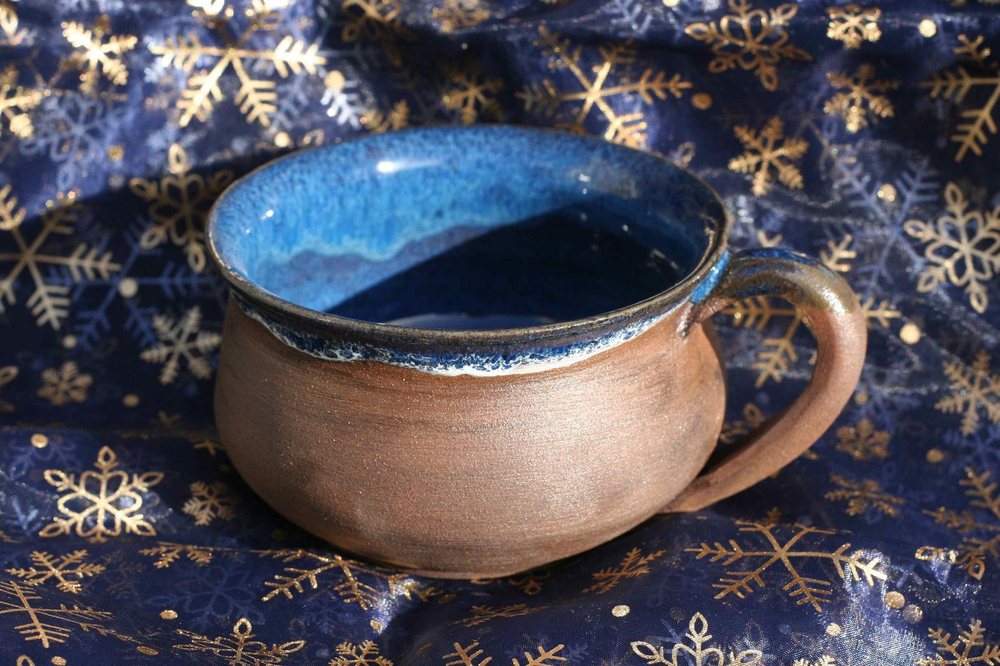

# Karel Jaromír Erben - Hrneèku, vaø!

V jedné vsi byla chudá vdova a mìla dceru. Zùstávaly v staré chalupì s doškovou roztrhanou støechou a mìly na pùdì nìkolik slepic. Stará chodila v zimì do lesa na døíví, v létì na jahody a na podzim na pole sbírat a mladá nosila do mìsta vejce na prodej, co jim slepice snesly. Tak se spolu �ivily.

Jednou v létì stará se trochu roznemohla a mladá musela sama do lesa na jahody, aby mìly co jíst; vaøily si z nich kaši. Vzala hrnec a kus èerného chleba a šla. Kdy� mìla hrnec plnı jahod, pøišla v lese k jedné studánce; tu si k té studánce sedla, vyndala si ze zástìry chléb a zaèala obìdvat. Bylo právì poledne.

Najednou se tu odkud odtud vzala nìjaká stará �ena, vypadala jako �ebraèka, a v ruce dr�ela hrneèek. "Ach má zlatá panenko," povídá ta �ebraèka, "to bych jedla! Od vèerejška od rána nemìla jsem ani kouska chleba v ústech. Nedala bys mi kousek toho chleba?"

"I proèpak ne," øekla ta holka, "chcete-li, tøeba celı; však já domù dojdu. Jen nebude-li vám tuze tvrdı?" A dala jí celı svùj obìd.

"Zapla� pánbùh, má zlatá panenko, zapla� pánbùh! - Ale kdy� jsi, panenko, tak hodná, musím ti taky nìco dát. Tuhle ti dám ten hrneèek. Kdy� ho doma postavíš na stùl a øekneš: Hrneèku, vaø! navaøí ti tolik kaše, co budeš chtít. A kdy� budeš mylsit, �e u� máš kaše dost, øekni: Hrneèku, dost! a hned pøestane vaøit. Jen nezapomeò, co máš øíct." - Tu jí ten hrneèek podala a najednou ztratila se zas, holka ani nevìdìla kam.

Kdy� pøišla domù, povídá matce, co se jí v lese pøihodilo, a hned postavila hrneèek na stùl a øekla: "Hrneèku, vaø!" Chtìla zvìdìt, jestli ji ta �ebraèka neobelhala. Ale hned se zaèala v hrneèku ode dna kaše vaøit, a poøád jí bylo víc a víc, a co by deset napoèítal, byl u� hrneèek plnı. "Hrneèku, dost!" a hrneèek pøestal vaøit.

Hned si obì sedly a s chutí se jedly; kaše jako mandle. Kdy� se najedly, vzala mladá do košíèka nìkolik vajec a nesla je do mìsta. Ale musela tam s nimi dlouho na trhu sedìt, dávali jí za nì málo, a� teprv v samı veèer je prodala.

Stará doma nemohla se jí doèkat, u� se jí taky chtìlo jíst, a mìla zas na kaši chu�. Vzala tedy hrneèek, postavila ho na stùl a sama øekla: "Hrneèku , vaø!" Tu se v hrneèku zaèala hned kaše vaøit, a sotva se stará otoèila, byl u� plnı.

"Musím si taky pro misku a pro l�íci dojít," povídá si stará a jde pro to do komory. Ale kdy� se vrátila, zùstala leknutím jako omráèená: kaše valila se plnım hrdlem z hrneèku na stùl, ze stolu na lavici a za lavice na zem. Stará zapomnìla, co má øíct, aby hrneèek pøestal vaøit. Pøiskoèila a pøikryla hrneèek miskou; myslila, �e tím kaši zastaví. Ale miska spadla na zem a roztloukla se, a kaše hrnula se neustále dolù jako povodeò. U� jí bylo v sednici tolik, �e stará odtud musela do sínì utéct; tu lomila rukama a bìdovala: "Ach ta neš�astná holka, co to pøinesla; já jsem si hned pomyslila, �e to nebude nic dobrého!"

Za chvilku tekla u� kaše ze sednièky pøes práh do sínì; èím jí bylo víc, tím jí víc pøibıvalo. Stará u� nevìdìla kudy kam, i vylezla v té úzkosti na pùdu a poøád bìdovala, co to ta neš�astná holka domù pøinesla. Zatím bylo kaše poøád víc a víc, a netrvalo dlouho, valila se u� jako mraèna dveømi i oknem na náves, na silnici, a kdo ví, jakı by to bylo vzalo konec, kdyby se byla právì naštìstí maldá nevrátila a nekøikla: "Hrneèku, dost!"

Ale na návsi byl u� takovı kopec kaše, �e sedláci, kdy� tudy veèer jeli z roboty domù, nikterak nemohli projet a museli se skrze kaši na druhou stranu prokousat.