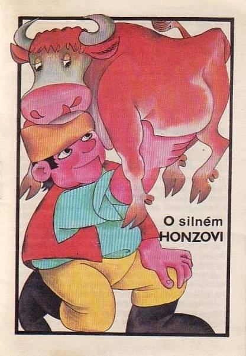

### O silném Honzovi
#### Joseph Haltrich

Jednomu muži zemřela žena a zanechala mu tři dcery. Tak se znovu oženil a druhá žena mu porodila synka, kterého pojmenovali Honza. Matka Honzíka tak milovala, že ho už sedmý rok kojila, což se jejímu muži zdálo příliš a jednoho dne hněvivě zvolal: „Z tebe by měla být kráva!“ Jen to vypustil z huby, stalo se! Místo ženy tu stála kráva, a tak muži nezbylo nic jiného, než aby ji každý den posílal se synkem na pastvu. Honzíkovi to bylo po chuti, teď mohl pít mléko celý den a nikdo mu při tom nepřekážel. Každé ráno dostával sice k jídlu na pastvu jen popelový koláč, ale ten cestou zahodil a živil se mlékem.

A běžel čas, jak bývá jeho zvykem, neúprosně a bez ustání.

Z toho dobrého živobytí za krátkou dobu povyrostl a zesílil, až to přišlo otci divné, neboť to nemohlo pocházet od popelových koláčů. Jednoho dne tedy řekl své nejmladší dceři: „Jdi dnes s bratrem na pastvu a dobře se dívej, co celý den dělá!“ Když přišli do polí, Honza chleba zahodil a sestra se ptala: „Co teď budeš jíst?“ Odvětil: „Já žiji ze vzduchu!“ Ale měl vám, kdoví kde ji vzal, takovou lahvičku, kdo se z ní napil, upadnul ihned do tvrdého spánku. Když dostal hlad, řekl sestře: „Nemáš žízeň? Napij se!“ A protože den byl opravdu dusný, tak se napila a než by jeden okem mrknul, spala, jako když ji do vody hodí. A Honza pil až do večera mléko do matky krávy. Když přišli domů, otec se zeptal dcery: „Copak Honza dnes dělal?“ A ona odvětila: „Když jsme přišli do polí, zahodil svůj chleba a když jsem se ptala, co bude jíst, odvětil, že žije ze vzduchu.“ A bylo to!

Druhého rána poslal otec prostřední dceru, ale té se vedlo jako té první, nedokázala otci říci o nic více. Třetího dne řekl otec své nejstarší dceři: „Jdi s ním dnes ty a dávej dobrý pozor, co se bude dít!“ Když přišli do polí, zahodil Honza svůj chleba z popela a zvolal: „Takového jídla mi netřeba!“ „A z čeho tedy žiješ?“ zeptala se ho sestra. „Už jsi to přeci slyšela, žiji ze vzduchu!“ Tomu se dívka zasmála a pomyslila si: „Jen počkej, mne neobelstíš!“ Když byl Honza hladový, dal své nejstarší sestře napít z lahvičky a ona upadla okamžitě do hlubokého spánku. Avšak tahle sestra měla na šíji ještě dvě tajné oči a ty zůstávaly stále otevřené, i když ty dvě na čele spaly; viděla vše, co se dělo. Honza šel ke své matce a pil mléko jako vždy. Když přišli večer domů a otec se sestry ptal: „Žil dnes bratr opět ze vzduchu?“ Dívka odvětila: „Ne!“ a vyprávěla, jak to všechno bylo. Otec se strašlivě rozhněval a Honzovi řekl: „Protože stále piješ mléko a mne a svoje sestry jsi obelhával, zítra i s tou krávou zemřeš!“ Chlapec byl celý zarmoucený a šel do stáje za matkou a stěžoval si jí. „Neboj se ničeho, mé dítě,“ odvětila kráva: „přijď zítra dříve, než se rozední, ke mně!“ Když Honza v určeném čase přišel a krávu odvázal, posadila si ho nahoru mezi rohy a utíkala s ním pryč, až doběhla do jednoho hlubokého černého lesa; tady by je nikdo nikdy nenašel.

A běžel čas, jak bývá jeho zvykem, neúprosně a bez ustání.

Celých sedm let žil Honza v tom lese, živil se mlékem a rostl do síly a krásy. Jednoho dne mu matka kráva pravila: „Jdi, vytrhni ten největší dub a postav ho na špičku!“ Honza šel, vytrhnul dub, ale na špičku ho postavit nedokázal. Tu jeho matka pravila: „Musíš pít mé mléko ještě sedm let!“ A když těch sedm let zase uběhlo, řekla kráva synkovi: „Už tě kojím třikrát sedm let, jdi a zkus ten nejmohutnější dub v lese postavit na špičku!“ Honza šel, vytrhl ten nejsilnější dub, jakoby to byl jen proutek, lehce ho převrátil a postavil na špičku. „Tak to má být,“ řekla matka: „nyní se už o sebe dokážeš postarat sám!“ A s těmito slovy odběhla pryč. Honza si z toho dubu vyrobil pořádný kyj a vydal se do světa.

A běžel čas, jak bývá jeho zvykem, neúprosně a bez ustání.

Honza vandroval světem sem a zase tam, jak mu bylo milo a příjemně. Jednoho dne dostal velkou žízeň a zrovna mu z hor přitékala v ústrety říčka, tak šel k ní, aby se napil. Nahoře na skále seděl nějaký mohutný chlap, který jen tak z dlouhé chvíle drtil v ruce kamení a tím prachem kalil vodu. Honza na něj zavolal: „Dej si pozor a nekal mi tu vodu, sic vyjdu nahoru a pak tě pánbů chraň!“ Ten chlap se ale jen smál, dál házel do vody rozemnuté kamení a volal: „Mě říkají Kámenmleč a klidně rozdrtím na prášek i tebe!“ Tu se Honza rozhněval, vyběhl nahoru, chlapa popadnul a zarazil ho až po ramena do země. „Nechej mne žít, budu ti sloužit!“ prosil Kámenmleč. „Tak dobrá!“ odvětil Honza, vytáhnul chlapa ven a dál putovali spolu. Přišli do lesa a tam uviděli nějakého dlouhána, vysokého jako jedle, který narovnával křivé stromy a ty rovné zase křivil. Tu ho Honza pokáral: „Nechej ty stromy být tak, jak narostly, jinak tě pánbů chraň!“ Ale ten dlouhán se jen smál, pokračoval ve svém díle a posměšně na Honzu volal: „Mě říkají Jedlíkroutil, klidně bych mohl zkroutit i tebe!“ Nu, to bylo něco na Honzíka, chlapa popadnul a zarazil ho do země a zapraštělo vám to, jako by bouře srazila k zemi ten nejmocnější dub. Dlouhán prosil o život a řekl, že mu bude sloužit, tak ho Honza zase vytáhnul a dál táhli společně.

s_hacek li tím černočerným lesem a za několik dnů natrefili na nějakou chalupu, ve které nebylo ani živáčka. Honza řekl: „Tady bychom mohli zůstat, dva budou chodit na lov, ten třetí zůstane doma a navaří.“ První den zůstal doma Kámenmleč. Když připravoval jídlo, objevil se tam najednou nějaký mužíček s vousem dlouhým sedm loktů a bědoval: „Ach, mě je zima, mě je zima!“ „Tak pojď a ohřej se!“ řekl mu Kámenmleč. Mužíček šel ke kamnům, chvíli se tam jen tak ochomýtal, pak najednou vyskočil, srazil dolů hrnec s jídlem a utekl pryč. Když ti druzí dva přišli hladoví domů a chtěli jíst, Kámenmleč jim vyprávěl, co se mu přihodilo. To bylo něco na hladového Honzíka! Vzal svůj kyj a milého kamaráda vyplácel tak dlouho, dokud ho hlad nepřešel. Následujícího dne zůstal doma Jedlíkroutil a vedlo se mu stejně jako kamarádovi. Přišel mužík, srazil hrnec a čiperně upaloval pryč. Když ti dva přišli hladoví domů a zase nic nenašli, tak si hladový Honza vzal kamaráda do parády.

Třetího dne Honza řekl: „Dnes zůstanu doma já a to si pište, že dneska se jíst bude!“ Sotva byl hotový s vařením, objevil se tam ten mužík a naříkal: „Ach, mě je zima, mě je zima!“ „Tak pojď a ohřej se!“ řekl Honza, ale sám se posadil vedle hrnce a měl mužíka stále v oku. Když se přiblížil k hrnci, Honza ho bleskurychle popadl za vousy, vzal lžíci a bil ho s ní přes hubu i záda tak dlouho, dokud nezůstal bez pohybu ležet. Pak ho vynesl ven a za vousiska přivázal k jednomu mohutnému dubu. Potom ve světnici v klidu dokončil jídlo. Ti druzí přispěchali domů, protože se těšili, že dneska dostane výprask Honza, ale na stole se kouřilo z mísy, a tak si museli nechat na pomstu zajít chuť. Když se najedli, Honza řekl: „Pojďme se podívat na toho mužíka, který vám shazoval hrnce. Já jsem ho venku přivázal k jednomu stromu.“ Když ale vyšli ven, mužík tam nebyl, jen na tom místě, kde stál strom, byla hluboká jáma. „Počkejte,“ řekl Honza: „já ho najdu!“ Upletli z kůry stromů dlouhý provaz a spustili Honzu dolů do té jámy.

Třikrát sedm dnů Honzovi trvalo, než dorazil na dno a ocitl se v dlouhé tmavé chodbě, kterou kráčel dál a dál. Vypadalo to, že té temné chodby nebude nikdy konce, ale za nějaký ten čas se trochu rozjasnilo a když šel ještě kousek, otevřelo se nad ním nebe. Před sebou uviděl obrovský palác, a když do něj vstoupil, našel v jedné komnatě tři krásné princezny, které usedavě plakaly a naříkaly. Když uviděly Honzu, řekly: „Kde ses tu vzal, ubohý človíčku,? Náš pán je dvanáctihlavý drak, když tě tu přistihne, jsi ztracen!“ „Já se nebojím,“ řekl Honza: „jen ať přijde, hned se s ním vypořádám!“ A sotva to dořekl, drak byl tu. Přihnal se jak velká voda, s takovou silu, jen u toho dštil oheň a síru. „Cítím člověčinu!“ „Ty máš ale jemný čich, ty ohavná příšero!“ vykřikl Honza a na draka se vrhnul, popadnul ho za všechny hlavy a zardousil ho. Dračí tělo se ale ještě bojovně zmítalo, tak ho umlátil kyjem a bylo to. Drak tu ležel natažený a více se nepohnul. Princezny se vrhly Honzovi kolem krku a děkovaly mu a prosily ho, aby je odvedl domů k panu králi. Honza souhlasil, ale nejdříve si prošel celý zámek a v poslední komnatě nalezl nesmírný poklad zlata, stříbra a drahokamů. Naložil si to bohatství na záda, vzal princezny a vedl je temnou chodbou až k místu, kde se spustil dolů. Zavolal na kamarády, že našel tři princezny a velikánský poklad, ty dvě starší princezny dostanou oni, ale ta nejmladší je jeho, ten poklad že si rozdělí, jen ho musí teď vytáhnout nahoru.

To udělali Kámenmleč a Jedlíkroutil velmi rádi, vytáhli tři panny a poklad; ale ta nejmladší princezna byla ta nejkrásnější, to se jim nezdálo, tak řekli jeden druhému: „Tu nesmí Honza nikdy dostat! Vytáhneme ho jen do poloviny a potom ho pustíme, spadne a rozmlátí se na padrť!“ Ale Honza něco takového od těch dvou čekal, na provaz uvázal pořádný balvan, který pak spadnout dolů a roztříštil se na tisíce malých kamínků. Ti dva nahoře popadli poklad a princezny a vydali se na zámek, ale brzy se to mezi nimi mělo k sváru a vádě, protože oba chtěli tu nejmladší princeznu.

Zatím si Honza dole lámal hlavu, jak se z téhle šlamastyky dostane. Bloumal podzemím a hlavou mu chodily černé myšlenky, protože žádný východ nenašel. Pak přišel do toho nejzapadlejšího kouta a koho tam nepotkal! Stále přivázaný k dubu tam klopýtal ten mužík s vousem dlouhým sedm loktů. Honza mu poručil, aby mu ukázal cestu na zem, a tak šel mužík před ním a ten strom vlekl za sebou. Tak šli a šli, až přišli k jednomu mohutnému a vysokému stromu, který má špičkou už na božím světě, jen musí vylézt nahoru. Sedm dní lezl Honza vzhůru a svět stále nikde, viděl jen malé, velmi vzdálené světýlko. To světýlko, to byl horní svět, ale jak se tam dostane? Zatímco takto přemýšlel, uviděl hnízdo ptáka Noha s mladými. A zrovna se k nim plazil hrozitánský notně hladový had. Když mladí Nohové hada zpozorovali, mávali ustrašeně křídly a křičeli: „Milý muži, pomoz nám, jinak jsme ztraceni!“ Honzík nelenil, popadnul kyj a rozdrtil hadovi hlavu, jeho tělo holýma rukama roztrhal na tisíc kousků. Mezitím se vrátil starý pták Noh, a když uviděl u hnízda Honzu potřísněného krví, ihned si pomyslel: „Ha, zabil moje děti!“ a v návalu vzteku Honzu spolknul. Pak si ale všimnul, že mláďata jsou nezraněná, a když mu vyprávěla, jak je ten muž zachránil před zlým hadem a naříkala a plakala, že se mu za to dostalo tak kruté odplaty, zastyděl se za svoji ukvapenost a Honzu zase vyplivnul; nu, ten vám byl najednou stokrát krásnější a urostlejší, radost pohledět!

Vděčný pták Noh mu nabídnul: „Protože jsi zachránil mé děti, můžeš si něco přát!“ „Vynes mě nahoru na Boží svět!“ přál si Honza. „Dobrá, ale nebude to snadná cesta. Obstarej mi sedm sudů vína a sedm volů, abych měl jídlo na cestu, neboť je to dál, než si myslíš.“ Honza z toho vysokánského stromu zase sestoupil dolů, v zámku si naložil na záda vše potřebné a vynesl to nahoru. Nu, trvalo to hezkých pár dní. Pak vše naložil na ptáka Noha, sám si mu sedl za krk a vydali se na cestu. Cestou pták Noh křičel: „Maso! Víno!“ a Honza mu dal vždy jednoho vola a sud vína. Když bylo vše snědeno, dospěli konečně na horní svět. Honza sestoupil a Nohovi děkoval; ten se pak jako blesk vrhnul dolů ke svému hnízdu.

Honza se vydal na královský zámek, cestou potkal dva urozené a bohaté prince, kteří se vydali do světa, aby si našli nevěsty. „Víte co? Pojďte se mnou, já pro vás mám nevěsty.“ řekl jim Honza a oni ho následovali. Měl totiž na mušce ty svoje dva nevěrné kamarády a myslel i na krásné princezny, hlavně na tu nejmladší a nejkrásnější, která má být jeho ženou. A netrvalo to ani sedm slepičích kýchnutí a už je měl. Prali se tu na cestě jako dva psi, to kvůli té nejmladší princezně, kterou mohl mít jen jeden a stále nebylo jasné, který to bude. Princezny stály opodál a ustrašeně přihlížely. Honza se mezi ně vrhnul zrovna, když se měli k tomu, že se dočista zabijí, a oni zůstali stát jako opaření. „Vy zbabělci a bídáci, protože jste mě chtěli oklamat, dostane se vám nyní zasloužené odměny!“ S těmi slovy pozvedl svůj kyj a jednou ranou oba zabil. A bylo to! Potom šel k princeznám a zeptal se té nejmladší, zda by ho chtěla za manžela. A protože bez váhání kývla, řekl těm dvěma starším: „Každá žena musí mít muže, postarám se tedy i o vás.“ Zavedl je k oběma princům a každému dal jednu, pak se s nimi rozdělil i o ten obrovský poklad a slavili společně svatbu.

Nu a pak? Co bylo pak? Žili šťastně a spokojeně, dokud neumřeli. [pozn1]